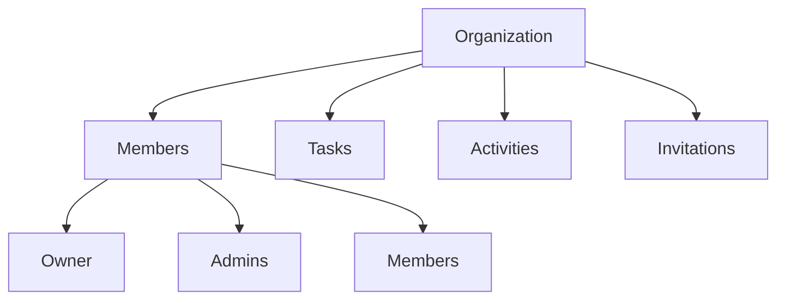

# Orbit Cron Manager - Technical Documentation

## System Overview

Orbit Cron Manager (OCM) is a task scheduling and automation platform built with React, TypeScript, and Supabase. The system follows a strict organization-first model where all resources (tasks, activities, etc.) must belong to an organization.

## Core Concepts

### 1. Organization Model

The system enforces a hierarchical structure:
- Users must belong to an organization to use the system
- All resources (tasks, logs, etc.) are organization-scoped
- Organizations have members with different roles (owner, admin, member)
- Team invitations system for member onboarding



### 2. Database Schema

#### Organizations Table
```sql
CREATE TABLE organizations (
  id UUID PRIMARY KEY DEFAULT gen_random_uuid(),
  name TEXT NOT NULL,
  created_at TIMESTAMPTZ DEFAULT now()
);
```

#### Organization Members Table
```sql
CREATE TABLE organization_members (
  id UUID PRIMARY KEY DEFAULT gen_random_uuid(),
  organization_id UUID REFERENCES organizations(id) ON DELETE CASCADE,
  user_id UUID REFERENCES users(id) ON DELETE CASCADE,
  role user_role DEFAULT 'member',
  created_at TIMESTAMPTZ DEFAULT now(),
  last_active_at TIMESTAMPTZ DEFAULT now(),
  UNIQUE(organization_id, user_id)
);
```

#### Team Invitations Table
```sql
CREATE TABLE team_invitations (
  id UUID PRIMARY KEY DEFAULT gen_random_uuid(),
  organization_id UUID NOT NULL REFERENCES organizations(id) ON DELETE CASCADE,
  email TEXT NOT NULL,
  invited_by UUID NOT NULL REFERENCES auth.users(id) ON DELETE CASCADE,
  message TEXT,
  status TEXT NOT NULL CHECK (status IN ('pending', 'accepted', 'expired')),
  created_at TIMESTAMPTZ DEFAULT now(),
  expires_at TIMESTAMPTZ DEFAULT (now() + interval '7 days'),
  UNIQUE(organization_id, email)
);
```

#### Tasks Table
```sql
CREATE TABLE tasks (
  uuid UUID PRIMARY KEY DEFAULT uuid_generate_v4(),
  task_name TEXT NOT NULL UNIQUE,
  cron_expression TEXT NOT NULL,
  command JSONB,
  endpoint JSONB,
  is_command BOOLEAN NOT NULL,
  is_request BOOLEAN NOT NULL,
  launch_on_save BOOLEAN DEFAULT false,
  last_execution_date TEXT,
  last_execution_result TEXT,
  mail_recipients JSONB,
  state TEXT DEFAULT 'ACTIVE',
  created_by UUID REFERENCES users(id),
  created_at TIMESTAMPTZ DEFAULT now(),
  execution_logs JSONB,
  description TEXT,
  priority TEXT,
  timeout INTEGER,
  max_retries INTEGER,
  retry_delay INTEGER,
  tags TEXT[],
  notification_settings JSONB,
  organization_id UUID REFERENCES organizations(id) ON DELETE CASCADE
);
```

#### Team Activities Table
```sql
CREATE TABLE team_activities (
  id UUID PRIMARY KEY DEFAULT gen_random_uuid(),
  organization_id UUID NOT NULL REFERENCES organizations(id) ON DELETE CASCADE,
  user_id UUID NOT NULL REFERENCES auth.users(id) ON DELETE CASCADE,
  action TEXT NOT NULL,
  details JSONB,
  created_at TIMESTAMPTZ DEFAULT now(),
  activity_type TEXT,
  ip_address TEXT,
  user_agent TEXT,
  metadata JSONB,
  severity TEXT,
  status TEXT
);
```

### 3. Security Model

#### Row Level Security (RLS)
All tables implement RLS policies to ensure data isolation between organizations:

```sql
-- Organizations
CREATE POLICY "Create organizations"
  ON organizations FOR INSERT
  TO authenticated
  WITH CHECK (true);

CREATE POLICY "View organizations"
  ON organizations FOR SELECT
  TO authenticated
  USING (id IN (
    SELECT organization_id 
    FROM organization_members 
    WHERE user_id = auth.uid()
  ));

-- Tasks
CREATE POLICY "Users can create tasks in their organization"
  ON tasks FOR INSERT
  TO authenticated
  WITH CHECK (organization_id IN (
    SELECT organization_id 
    FROM organization_members 
    WHERE user_id = auth.uid()
  ));

CREATE POLICY "Users can read tasks in their organization"
  ON tasks FOR SELECT
  TO authenticated
  USING (organization_id IN (
    SELECT organization_id 
    FROM organization_members 
    WHERE user_id = auth.uid()
  ));

-- Team Invitations
CREATE POLICY "Organization members can create invitations"
  ON team_invitations FOR INSERT
  TO authenticated
  WITH CHECK (organization_id IN (
    SELECT organization_id 
    FROM organization_members 
    WHERE user_id = auth.uid()
  ));

CREATE POLICY "Organization members can view invitations"
  ON team_invitations FOR SELECT
  TO authenticated
  USING (organization_id IN (
    SELECT organization_id 
    FROM organization_members 
    WHERE user_id = auth.uid()
  ));
```

### 4. Activity Logging

The system maintains comprehensive activity logs at two levels:

#### Team Activities
```typescript
type TeamActivityAction = 
  | 'member_joined'
  | 'member_left'
  | 'member_invited'
  | 'role_updated'
  | 'task_created'
  | 'task_updated'
  | 'task_deleted';

interface TeamActivity {
  id: string;
  organization_id: string;
  user_id: string;
  action: TeamActivityAction;
  details?: any;
  created_at: string;
}
```

#### User Activities
```typescript
interface UserActivity {
  id: string;
  user_id: string;
  action: string;
  details: any;
  activity_type: 'auth' | 'data' | 'task' | 'system';
  category: string;
  status: 'success' | 'failure' | 'pending';
  created_at: string;
}
```

Activities are automatically logged for:
- Team member changes (join, leave, role updates)
- Task operations (create, update, delete)
- Authentication events (login, logout)
- System events (configuration changes, errors)

### 5. Team Management

#### Member Roles
```typescript
type UserRole = 'owner' | 'admin' | 'member';

interface TeamMember {
  id: string;
  email: string;
  role: UserRole;
  created_at: string;
  last_active_at: string;
  organization_id: string;
  organization_name: string;
}
```

#### Invitation System
```typescript
interface TeamInvitation {
  id: string;
  email: string;
  message: string | null;
  status: 'pending' | 'accepted' | 'expired';
  created_at: string;
  expires_at: string;
  invited_by: string;
  organization_id: string;
}
```

Features:
- Role-based access control
- Member activity tracking
- Email invitations with expiry
- Last active time tracking
- Team statistics and analytics

### 6. Task Execution

Tasks can be either commands or HTTP requests:

#### Command Tasks
```typescript
interface Command {
  script: string;
  type: 'bash' | 'pwsh';
  options?: {
    timeout_enabled?: boolean;
    elevated_privileges?: boolean;
    save_output?: boolean;
    timeout?: number;
  };
}
```

#### HTTP Request Tasks
```typescript
interface Endpoint {
  url: string;
  method: 'GET' | 'POST' | 'PUT' | 'DELETE';
  headers?: Record<string, string>;
  data?: any;
  options?: {
    timeout?: number;
    retry?: {
      enabled: boolean;
      max_attempts?: number;
      delay?: number;
    };
  };
}
```

### 7. Frontend Architecture

The application follows a feature-based architecture with strict organization access control:

```
src/
├── features/
│   ├── auth/        # Authentication
│   ├── tasks/       # Task management
│   └── team/        # Team management
├── components/
│   ├── Layout/      # Main layout
│   └── OrganizationGuard/  # Organization access control
├── hooks/
│   ├── useAuth/     # Authentication state
│   └── useTeam/     # Team management
└── lib/
    ├── activity.ts  # Activity logging
    └── errors.ts    # Error handling
```

Key features:
- Organization-first routing with guards
- Real-time updates using Supabase subscriptions
- Comprehensive activity logging
- Role-based UI adaptations
- Team collaboration features

### 8. Error Handling

Centralized error handling through custom error classes and logging:

```typescript
class AppError extends Error {
  constructor(
    message: string,
    public code?: string,
    public details?: string
  ) {
    super(message);
    this.name = 'AppError';
  }
}

function logError(error: unknown, context?: string): void {
  const errorDetails = {
    timestamp: new Date().toISOString(),
    context,
    error: error instanceof Error ? {
      name: error.name,
      message: error.message,
      stack: error.stack
    } : error
  };
  console.error('🎛️ Application error:', errorDetails);
}
```

### 9. Performance Optimizations

#### Database Indexes
```sql
-- Tasks
CREATE INDEX idx_tasks_organization ON tasks(organization_id);
CREATE INDEX idx_tasks_priority ON tasks(priority);
CREATE INDEX idx_tasks_search ON tasks USING gin(to_tsvector('english', task_name || ' ' || description));
CREATE INDEX idx_tasks_tags ON tasks USING gin(tags);

-- Team Activities
CREATE INDEX idx_team_activities_org ON team_activities(organization_id);
CREATE INDEX idx_team_activities_created_at ON team_activities(created_at DESC);
CREATE INDEX idx_team_activities_search ON team_activities USING gin(to_tsvector('english', action || ' ' || details::text));

-- Team Invitations
CREATE INDEX idx_team_invitations_org ON team_invitations(organization_id);
CREATE INDEX idx_team_invitations_email ON team_invitations(email);
CREATE INDEX idx_team_invitations_status ON team_invitations(status);
CREATE INDEX idx_team_invitations_expires ON team_invitations(expires_at);
```

#### Caching Strategy
- Client-side caching of task configurations
- Memoization of expensive computations
- Optimistic UI updates
- Real-time sync with debouncing

### 10. Future Considerations

Planned enhancements:
- Advanced analytics dashboard
- Custom integrations framework
- Workflow automation
- Enhanced team collaboration features
- Advanced notification options
- OAuth provider integration
- Audit log exports
- Custom role permissions

## Conclusion

The Orbit Cron Manager implements a secure, scalable, and maintainable architecture with a strong focus on team collaboration and activity tracking. The organization-first model ensures proper data isolation and access control, while the comprehensive activity logging system provides full audit capabilities.